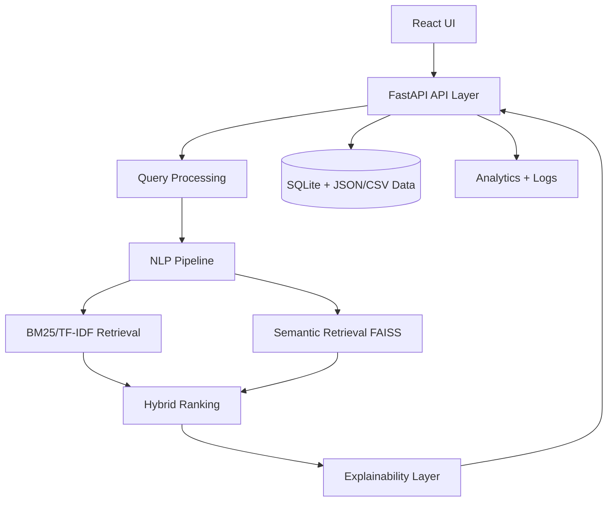
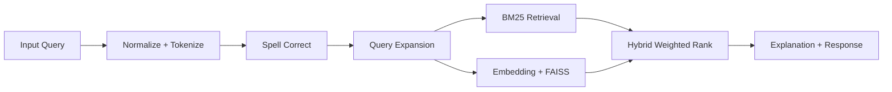

# Smart Medical Store Information Retrieval System

Production-style hybrid Information Retrieval system for pharmacy/medicine search with lexical retrieval (TF-IDF + BM25), semantic retrieval (MiniLM + FAISS), typo correction, alias mapping, explainable ranking, analytics, and a modern React dashboard.

## Features
- Keyword, symptom, brand/generic, and typo-tolerant search
- Hybrid scoring: `alpha * BM25 + beta * semantic_similarity`
- Query understanding: normalization, stemming, lemmatization, synonym/alias/symptom expansion
- Filters: category, availability, price range, prescription flag, dosage form
- Explainability: lexical hits, semantic score, alias/symptom overlap, retrieval source
- Autocomplete and suggestion endpoints
- Admin analytics: popular queries, failed queries, average latency
- 600-record realistic synthetic medicine dataset (`CSV`, `JSON`, `SQLite`)
- Evaluation scripts: Precision, Recall, F1, MAP, NDCG, MRR
- Unit, API integration, and load test setup

## Architecture



## Query Pipeline


## Project Structure
- `backend/app/main.py`: API endpoints and middleware
- `backend/app/services/preprocessing.py`: NLP/query processing
- `backend/app/services/retrieval.py`: BM25 + FAISS + ranking logic
- `backend/app/services/analytics.py`: query analytics
- `backend/app/evaluation/evaluate.py`: evaluation metrics pipeline
- `backend/app/tests/`: unit, API, and load tests
- `frontend/src/App.tsx`: UI with search, results, and dashboard
- `data/generate_dataset.py`: synthetic dataset generation and SQLite loading
- `docs/`: technical report, PPT script, viva Q&A, deployment guide

## Setup
1. Create venv and install dependencies:
   - `python -m venv .venv`
   - `.venv\Scripts\activate`
   - `pip install -r requirements.txt`
2. Generate dataset:
   - `python data/generate_dataset.py`
3. Start backend:
   - `uvicorn app.main:app --reload --app-dir backend`
4. Start frontend:
   - `cd frontend && npm install && npm run dev`

## API Endpoints
- `POST /search`
- `POST /semantic-search`
- `GET /autocomplete?q=...`
- `GET /suggest?q=...`
- `GET /medicine/{id}`
- `POST /add-medicine`
- `PUT /update-medicine/{id}`
- `DELETE /delete-medicine/{id}`
- `GET /metrics`
- `GET /logs`

## Example Search Request
```json
{
  "query": "paracetmol for fever",
  "top_k": 10,
  "use_hybrid": true,
  "filters": {
    "category": "Analgesic",
    "availability": "in_stock"
  }
}
```

## Evaluation
- Run: `python backend/app/evaluation/evaluate.py`
- Outputs aggregate metrics over labeled query relevance set.

## Testing
- Unit + integration: `pytest backend/app/tests -q`
- Performance: `locust -f backend/app/tests/locustfile.py --host http://127.0.0.1:8000`

## Deployment Ready
- Dockerized backend + frontend + volume-based data persistence
- Deployment guides included for Render, Railway, HuggingFace Spaces, and AWS EC2 in `docs/deployment_guide.md`
